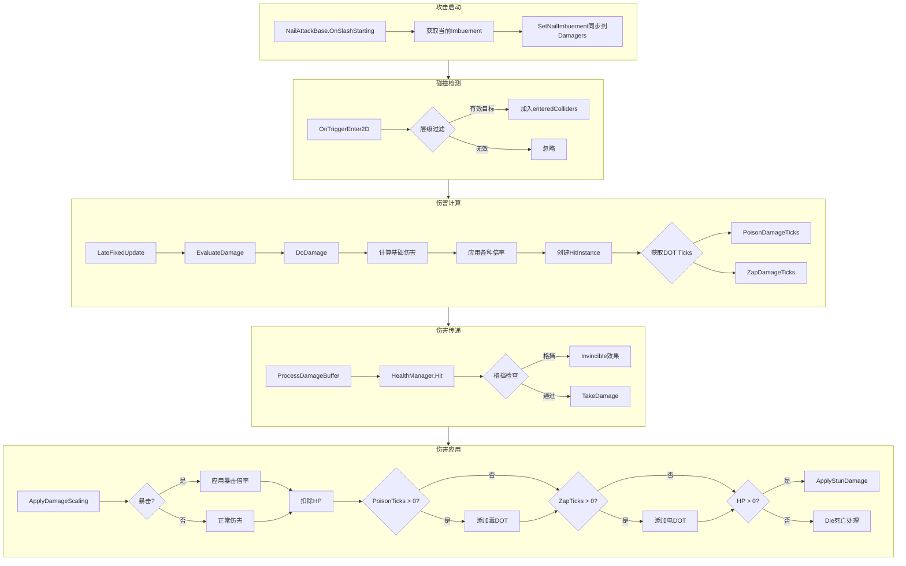
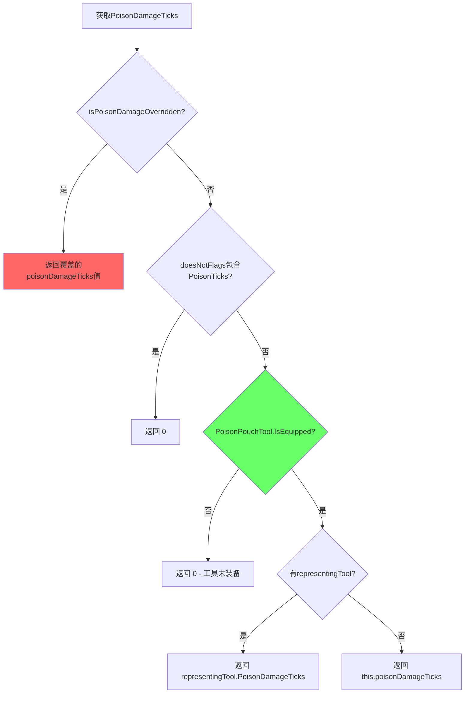

# 攻击伤害系统完整分析文档

## 目录
1. [系统概述](#系统概述)
2. [核心组件](#核心组件)
3. [伤害流程](#伤害流程)
4. [HitInstance 参数详解](#hitinstance-参数详解)
5. [DOT伤害系统](#dot伤害系统)
6. [流程图](#流程图)
7. [十字斩毒效果Bug分析与修复](#十字斩毒效果bug分析与修复)

---

## 系统概述

游戏的伤害系统由以下核心组件协作完成：
- **NailAttackBase**: 攻击基类，处理攻击启动和Imbuement效果
- **DamageEnemies**: 伤害计算核心，处理碰撞检测和伤害创建
- **HitInstance**: 攻击实例数据结构，携带所有攻击参数
- **HealthManager**: 敌人生命管理，接收和处理伤害

---

## 核心组件

### 1. NailAttackBase (攻击基类)

**职责**: 管理攻击的生命周期和Imbuement效果同步

**关键方法**:
```csharp
// 攻击开始时调用，同步当前Imbuement效果
public virtual void OnSlashStarting()
{
    NailImbuementConfig currentImbuement = this.hc.NailImbuement.CurrentImbuement;
    if (currentImbuement != null)
    {
        this.SetNailImbuement(currentImbuement, this.hc.NailImbuement.CurrentElement);
    }
    // 触发攻击开始事件...
}

// 将Imbuement效果应用到所有Damager
public void SetNailImbuement(NailImbuementConfig config, NailElements element)
{
    foreach (DamageEnemies damageEnemies in this.damagers)
    {
        damageEnemies.NailElement = element;
        damageEnemies.NailImbuement = config;
    }
}
```

### 2. DamageEnemies (伤害计算核心)

**职责**: 碰撞检测、伤害计算、创建HitInstance、触发DOT

**关键属性**:
| 属性 | 类型 | 说明 |
|------|------|------|
| `attackType` | AttackTypes | 攻击类型（Nail/Heavy/Spell等） |
| `useNailDamage` | bool | 是否使用武器伤害 |
| `nailDamageMultiplier` | float | 武器伤害倍率 |
| `damageDealt` | int | 固定伤害值 |
| `stunDamage` | float | 眩晕伤害 |
| `NailImbuement` | NailImbuementConfig | Imbuement配置（火/毒/电） |
| `NailElement` | NailElements | 元素类型 |

**PoisonDamageTicks 属性** (关键！):
```csharp
public int PoisonDamageTicks
{
    get
    {
        // 1. 如果被强制覆盖，直接返回覆盖值（绕过工具检查！）
        if (this.isPoisonDamageOverridden)
        {
            return this.poisonDamageTicks;
        }
        // 2. 检查是否禁用毒Ticks
        if (this.doesNotFlags.HasFlag(DoesNotFlags.PoisonTicks))
        {
            return 0;
        }
        // 3. ★关键：检查毒袋工具是否装备★
        if (!Gameplay.PoisonPouchTool.Status.IsEquipped)
        {
            return 0;
        }
        // 4. 返回工具或字段的值
        if (!this.representingTool)
        {
            return this.poisonDamageTicks;
        }
        return this.representingTool.PoisonDamageTicks;
    }
}
```

### 3. HitInstance (攻击实例)

**职责**: 携带单次攻击的所有参数

**完整字段列表**:
```csharp
public struct HitInstance
{
    // === 来源信息 ===
    public GameObject Source;           // 攻击来源GameObject
    public bool IsFirstHit;             // 是否首次命中（多段攻击用）
    
    // === 攻击类型 ===
    public AttackTypes AttackType;      // Nail/Heavy/Spell/Generic/Fire等
    public SpecialTypes SpecialType;    // 特殊类型标记（Piercer等）
    
    // === 元素效果 ===
    public NailElements NailElement;            // 元素类型（Fire/None等）
    public NailImbuementConfig NailImbuement;   // Imbuement配置
    
    // === DOT伤害 ===
    public int PoisonDamageTicks;       // 毒DOT次数
    public int ZapDamageTicks;          // 电DOT次数
    
    // === 伤害数值 ===
    public int DamageDealt;             // 实际伤害值
    public float StunDamage;            // 眩晕伤害
    public float Multiplier;            // 最终伤害倍率
    public int DamageScalingLevel;      // 伤害缩放等级
    
    // === 方向与击退 ===
    public float Direction;             // 攻击方向（角度）
    public bool CircleDirection;        // 从圆心向外计算方向
    public bool MoveDirection;          // 使用移动方向
    public float MagnitudeMultiplier;   // 击退力度倍率
    
    // === 特殊标记 ===
    public bool CanWeakHit;             // 可造成弱击
    public bool IgnoreInvulnerable;     // 忽略无敌
    public bool NonLethal;              // 非致命攻击
    public bool CriticalHit;            // 暴击
    public bool RageHit;                // 狂暴攻击
    public bool HunterCombo;            // 猎人连击
    public bool IsHeroDamage;           // 是否玩家伤害
    public bool IsNailTag;              // Nail Attack标签
    
    // === 丝绸生成 ===
    public HitSilkGeneration SilkGeneration;  // Full/Half/None
    
    // === 其他 ===
    public EnemyHitEffectsProfile.EffectsTypes HitEffectsType;
    public GameObject[] SlashEffectOverrides;
    public ToolDamageFlags ToolDamageFlags;
}
```

### 4. HealthManager (生命管理)

**职责**: 接收伤害、扣血、应用DOT、处理死亡

---

## 伤害流程

### 完整攻击流程

```
┌─────────────────────────────────────────────────────────────────────────┐
│                           攻击伤害流程                                    │
└─────────────────────────────────────────────────────────────────────────┘

1. 攻击启动阶段
   ┌───────────────────┐
   │ NailAttackBase    │
   │ OnSlashStarting() │
   └─────────┬─────────┘
             │
             ▼
   ┌───────────────────────────────────────────┐
   │ 获取当前Imbuement效果                       │
   │ currentImbuement = hc.NailImbuement        │
   │ currentElement = hc.NailImbuement.Element  │
   └─────────┬─────────────────────────────────┘
             │
             ▼
   ┌───────────────────────────────────────────┐
   │ SetNailImbuement()                         │
   │ - 设置刀光颜色                              │
   │ - 同步到所有DamageEnemies组件               │
   └─────────┬─────────────────────────────────┘
             │
2. 碰撞检测阶段
             │
             ▼
   ┌───────────────────┐
   │ DamageEnemies     │
   │ OnTriggerEnter2D  │
   └─────────┬─────────┘
             │
             ▼
   ┌───────────────────────────────────────────┐
   │ 碰撞体过滤                                  │
   │ - 排除 HERO_BOX, PLAYER, CORPSE 等层       │
   │ - 添加到 enteredColliders 列表              │
   └─────────┬─────────────────────────────────┘
             │
3. 伤害计算阶段
             │
             ▼
   ┌───────────────────┐
   │ LateFixedUpdate() │
   │ EvaluateDamage()  │
   └─────────┬─────────┘
             │
             ▼
   ┌───────────────────┐
   │ DoDamage()        │
   └─────────┬─────────┘
             │
             ▼
   ┌───────────────────────────────────────────┐
   │ 基础伤害计算                                │
   │                                            │
   │ if (useNailDamage):                         │
   │   damage = nailDamage * nailDamageMultiplier│
   │                                            │
   │ 应用倍率:                                   │
   │ - NailImbuement.NailDamageMultiplier (火刀) │
   │ - WarriorDamageMultiplier (狂暴模式)        │
   │ - HunterComboDamageMult (猎人连击)          │
   │ - DamageMultiplier (通用倍率)               │
   └─────────┬─────────────────────────────────┘
             │
             ▼
   ┌───────────────────────────────────────────┐
   │ 创建 HitInstance                           │
   │                                            │
   │ 设置所有攻击参数:                           │
   │ - AttackType, NailElement, NailImbuement   │
   │ - DamageDealt, StunDamage                  │
   │ - PoisonDamageTicks, ZapDamageTicks (DOT)  │
   │ - Direction, MagnitudeMultiplier           │
   │ - CriticalHit, RageHit 等标记              │
   └─────────┬─────────────────────────────────┘
             │
4. 伤害传递阶段
             │
             ▼
   ┌───────────────────────────────────────────┐
   │ 添加到 currentDamageBuffer                 │
   │ ProcessDamageBuffer()                      │
   └─────────┬─────────────────────────────────┘
             │
             ▼
   ┌───────────────────┐
   │ HealthManager.Hit │
   └─────────┬─────────┘
             │
             ▼
   ┌───────────────────────────────────────────┐
   │ 方向/格挡检查                              │
   │ IsBlockingByDirection()                    │
   │                                            │
   │ if (blocking):                             │
   │   Invincible() → 播放格挡效果               │
   │   return                                   │
   └─────────┬─────────────────────────────────┘
             │
5. 伤害应用阶段
             │
             ▼
   ┌───────────────────┐
   │ TakeDamage()      │
   └─────────┬─────────┘
             │
             ▼
   ┌───────────────────────────────────────────┐
   │ 伤害缩放 ApplyDamageScaling()              │
   │ - 根据武器升级等级应用倍率                  │
   │                                            │
   │ 快速子弹/炸弹/风暴衰减                      │
   │ - RapidBullet: 连续命中伤害递减             │
   │ - RapidBomb: 2秒内连续爆炸伤害递减          │
   └─────────┬─────────────────────────────────┘
             │
             ▼
   ┌───────────────────────────────────────────┐
   │ 暴击处理                                   │
   │ if (CriticalHit):                          │
   │   damage *= WandererCritMultiplier         │
   │   magnitudeMult *= WandererCritMagnitude   │
   │   播放暴击特效                              │
   │   触发画面冻结                              │
   └─────────┬─────────────────────────────────┘
             │
             ▼
   ┌───────────────────────────────────────────┐
   │ ★ DOT伤害应用 ★                            │
   │                                            │
   │ if (PoisonDamageTicks > 0):                │
   │   tagDamageTaker.AddDamageTagToStack(      │
   │     Gameplay.PoisonPouchDamageTag,         │
   │     PoisonDamageTicks                      │
   │   )                                        │
   │                                            │
   │ if (ZapDamageTicks > 0):                   │
   │   tagDamageTaker.AddDamageTagToStack(      │
   │     Gameplay.ZapDamageTag,                 │
   │     ZapDamageTicks                         │
   │   )                                        │
   └─────────┬─────────────────────────────────┘
             │
             ▼
   ┌───────────────────────────────────────────┐
   │ HP处理                                     │
   │                                            │
   │ hp = max(hp - damage, -1000)               │
   │                                            │
   │ if (hp > 0):                               │
   │   NonFatalHit() + ApplyStunDamage()        │
   │ else:                                      │
   │   Die() → 死亡处理                         │
   └───────────────────────────────────────────┘
```

---

## DOT伤害系统

### DOT类型

| DOT类型 | 来源 | 检查条件 | 触发方式 |
|---------|------|----------|----------|
| **毒DOT** | PoisonPouchTool | `Gameplay.PoisonPouchTool.Status.IsEquipped` | `tagDamageTaker.AddDamageTagToStack(PoisonPouchDamageTag, ticks)` |
| **电DOT** | ZapImbuementTool | `Gameplay.ZapImbuementTool.Status.IsEquipped` | `tagDamageTaker.AddDamageTagToStack(ZapDamageTag, ticks)` |
| **火DOT** | FireNail Imbuement | 通过 `NailImbuement.DamageTag` | `healthManager.AddDamageTagToStack(damageTag)` 或 `DoLagHits()` |

### DOT生效流程

```
┌─────────────────────────────────────────────────────────────────────────┐
│                           DOT伤害流程                                    │
└─────────────────────────────────────────────────────────────────────────┘

1. DOT Ticks 获取 (DamageEnemies)
   ┌───────────────────────────────────────────┐
   │ PoisonDamageTicks 属性                     │
   │                                            │
   │ ① isPoisonDamageOverridden? → 返回覆盖值   │
   │    (绕过所有检查！这是Bug的根源)            │
   │                                            │
   │ ② doesNotFlags.PoisonTicks? → 返回0        │
   │                                            │
   │ ③ PoisonPouchTool.IsEquipped? → 否则返回0  │
   │    ★ 这是正常的工具检查逻辑 ★              │
   │                                            │
   │ ④ 有representingTool? → 返回工具的值       │
   │    否则返回字段值                          │
   └─────────┬─────────────────────────────────┘
             │
2. HitInstance 创建
             │
             ▼
   ┌───────────────────────────────────────────┐
   │ 在 DamageEnemies.DoDamage() 中:            │
   │                                            │
   │ HitInstance hitInstance = new HitInstance  │
   │ {                                          │
   │   PoisonDamageTicks = this.PoisonDamageTicks│
   │   ZapDamageTicks = this.ZapDamageTicks     │
   │   ...                                      │
   │ }                                          │
   └─────────┬─────────────────────────────────┘
             │
3. DOT 应用到敌人
             │
             ▼
   ┌───────────────────────────────────────────┐
   │ 在 HealthManager.TakeDamage() 中:          │
   │                                            │
   │ if (hitInstance.PoisonDamageTicks > 0)     │
   │ {                                          │
   │   DamageTag poisonTag = Gameplay           │
   │     .PoisonPouchDamageTag;                 │
   │                                            │
   │   tagDamageTaker.AddDamageTagToStack(      │
   │     poisonTag,                             │
   │     hitInstance.PoisonDamageTicks          │
   │   );                                       │
   │ }                                          │
   └─────────┬─────────────────────────────────┘
             │
4. TagDamageTaker 处理
             │
             ▼
   ┌───────────────────────────────────────────┐
   │ TagDamageTaker.AddDamageTagToStack()       │
   │                                            │
   │ - 将DOT加入堆栈                            │
   │ - 按 tickInterval 定时触发伤害             │
   │ - 每次触发调用 HealthManager.ApplyTagDamage│
   └───────────────────────────────────────────┘
```

### 火焰Imbuement DOT (LagHits)

火焰DOT使用不同的机制 - `DoLagHits`:

```csharp
// 在 DamageEnemies.DoEnemyDamageNailImbuement() 中
private void DoEnemyDamageNailImbuement(HealthManager healthManager, HitInstance hitInstance)
{
    NailImbuementConfig nailImbuement = hitInstance.NailImbuement;
    
    // 检查命中次数是否达到触发条件
    if (!healthManager.CheckNailImbuementHit(nailImbuement, hitsToTag))
        return;
    
    // 方式1: 使用 DamageTag
    DamageTag damageTag = nailImbuement.DamageTag;
    if (damageTag)
    {
        healthManager.AddDamageTagToStack(damageTag);
        return;
    }
    
    // 方式2: 使用 LagHits (延迟多段伤害)
    NailImbuementConfig.ImbuedLagHitOptions lagHits = nailImbuement.LagHits;
    if (lagHits != null)
    {
        healthManager.DoLagHits(lagHits, hitInstance);
    }
}
```

---

## 流程图

### 伤害计算流程图 (Mermaid)



### PoisonDamageTicks 获取流程



---

## 十字斩毒效果Bug分析与修复

### Bug描述

十字斩攻击在玩家使用毒火工具之后，即使毒火工具的持续时间已经到期，仍然会附带中毒效果。

### 根本原因分析

在 `ChangeReaper.cs` 的 `SyncSingleDamagerDynamicEffects` 方法中：

```csharp
// 问题代码 - 位于 SyncSingleDamagerDynamicEffects()
if (poisonTicks > 0)
{
    targetDamager.OverridePoisonDamage(poisonTicks);  // ← 问题所在！
}
```

**问题分析**:

1. `OverridePoisonDamage(int value)` 方法会设置 `isPoisonDamageOverridden = true`
2. 一旦设置了这个标志，`DamageEnemies.PoisonDamageTicks` 属性会**直接返回覆盖值**
3. 这**绕过了** `Gameplay.PoisonPouchTool.Status.IsEquipped` 的检查
4. 因此，即使工具过期，也会继续造成毒伤害

**关键代码对比**:

```csharp
// DamageEnemies.PoisonDamageTicks 属性
public int PoisonDamageTicks
{
    get
    {
        // ★ BUG: 如果 isPoisonDamageOverridden = true，直接返回，
        // 不再检查工具是否装备！
        if (this.isPoisonDamageOverridden)
        {
            return this.poisonDamageTicks;
        }
        
        // 正常逻辑：检查工具是否装备
        if (!Gameplay.PoisonPouchTool.Status.IsEquipped)
        {
            return 0;  // 工具未装备返回0
        }
        // ...
    }
}
```

### 修复方案

**移除手动的 poison override 逻辑**，让 `DamageEnemies` 组件使用其原生的 `PoisonDamageTicks` 属性。原生属性会自动检查 `Gameplay.PoisonPouchTool.Status.IsEquipped`。

#### 修复代码

在 `ChangeReaper.cs` 中，修改 `SyncSingleDamagerDynamicEffects` 方法：

```csharp
/// <summary>
/// 同步单个 damager 的动态效果
/// </summary>
private void SyncSingleDamagerDynamicEffects(
    GameObject damagerObject, 
    NailImbuementConfig nailImbuement, 
    NailElements nailElement,
    int poisonTicks,  // 不再使用这个参数来覆盖
    int zapTicks,
    string damagerName)
{
    DamageEnemies targetDamager = damagerObject.GetComponent<DamageEnemies>();
    if (targetDamager == null)
    {
        Log.Warn($"DamageEnemies component not found on {damagerName} for dynamic sync");
        return;
    }

    // 同步 NailImbuement 和 NailElement（公开属性，可直接设置）
    targetDamager.NailImbuement = nailImbuement;
    targetDamager.NailElement = nailElement;

    // ★ 修复: 移除毒刀 override 逻辑 ★
    // 原生的 DamageEnemies.PoisonDamageTicks 属性会自动检查
    // Gameplay.PoisonPouchTool.Status.IsEquipped
    // 不需要手动同步，让原生逻辑处理即可
    
    // 旧代码（导致Bug）:
    // if (poisonTicks > 0)
    // {
    //     targetDamager.OverridePoisonDamage(poisonTicks);
    // }

    // 同步电刀 ticks（需要反射设置私有字段）
    // 注意：电刀的逻辑类似，也应该让原生属性处理
    // 但如果需要强制覆盖，需要在工具过期时清除
    // if (zapTicks > 0)
    // {
    //     var damagerType = typeof(DamageEnemies);
    //     var zapTicksField = damagerType.GetField("zapDamageTicks", 
    //         BindingFlags.NonPublic | BindingFlags.Instance);
    //     if (zapTicksField != null)
    //     {
    //         zapTicksField.SetValue(targetDamager, zapTicks);
    //     }
    // }
}
```

### 为什么这个修复有效

1. **原生属性已经有正确的逻辑**: `DamageEnemies.PoisonDamageTicks` 属性会检查 `Gameplay.PoisonPouchTool.Status.IsEquipped`
2. **每次攻击都会实时检查**: 因为 `PoisonDamageTicks` 是属性（getter），每次访问都会执行检查逻辑
3. **工具过期时自动失效**: 当工具过期，`IsEquipped` 变为 `false`，属性自动返回 `0`

### 可选：保留手动同步但正确处理

如果有特殊原因需要保留手动同步逻辑，可以这样修改：

```csharp
// 每次生成时都重新检查工具状态
int currentPoisonTicks = GetPoisonTicksFromEquipment();

// 无论是否有毒，都要设置正确的值
// 这样当工具过期时，会传入 0，清除之前的覆盖
targetDamager.OverridePoisonDamage(currentPoisonTicks);
```

但这需要修改 `OverridePoisonDamage` 方法的行为，或者添加新的方法来处理"取消覆盖"的情况。**最简单的方案仍然是移除手动覆盖，使用原生逻辑。**

---

## 附录：攻击类型枚举

```csharp
public enum AttackTypes
{
    Generic,
    Nail,
    Heavy,
    Spell,
    Acid,
    RuinsWater,
    Splatter,
    SharpShadow,
    Lava,
    NailBeam,
    Hunter,
    Explosion,
    Lightning,
    Fire,
    Coal,
    Trap,
    Spikes,
    ExtractMoss,
    // ...
}
```

## 附录：HitSilkGeneration 枚举

```csharp
public enum HitSilkGeneration
{
    Full,   // 完整丝绸生成
    Half,   // 一半丝绸生成
    None    // 不生成丝绸
}
```
